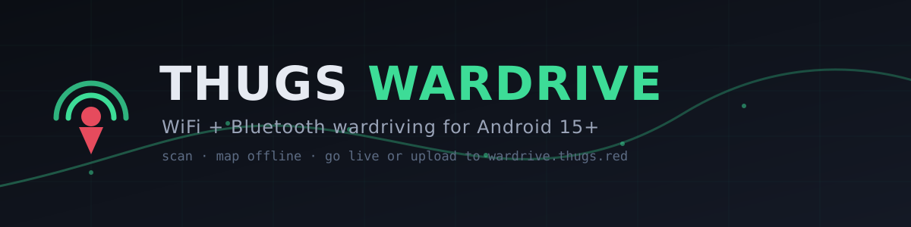
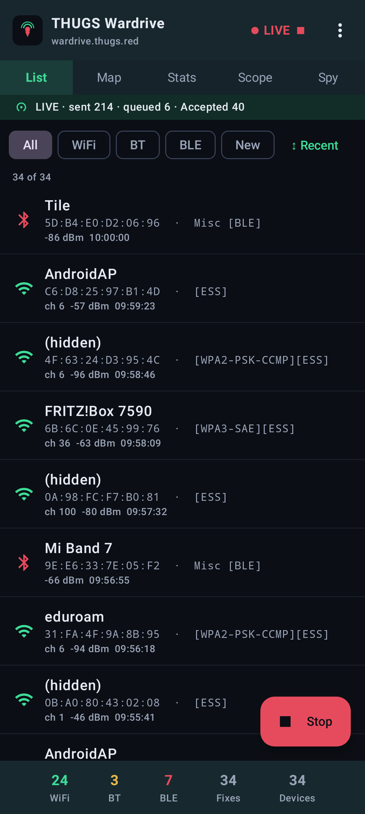
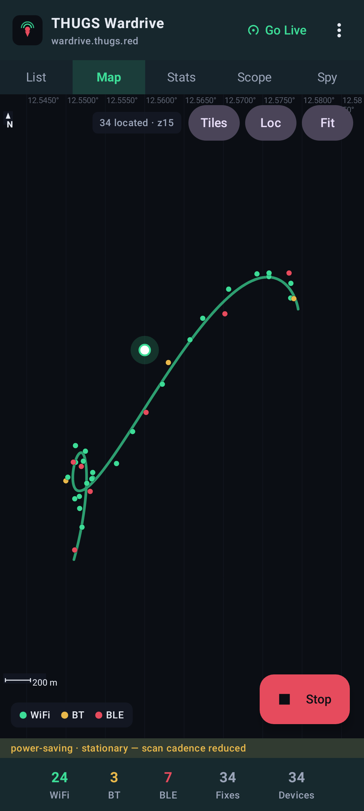
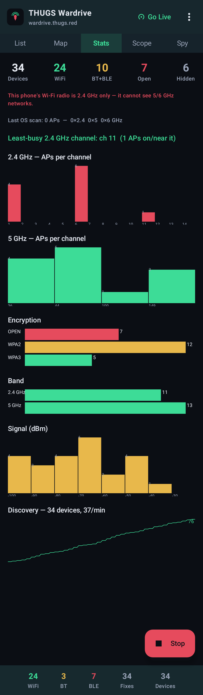
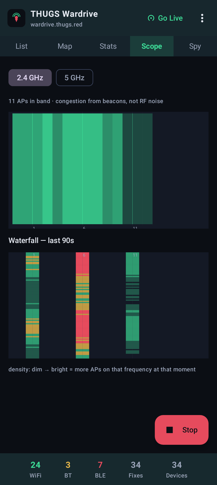
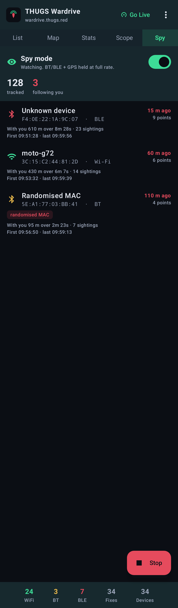
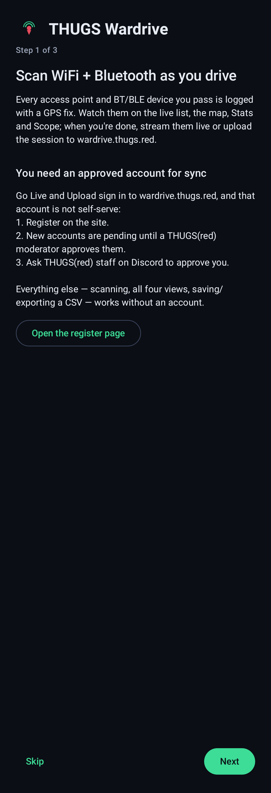
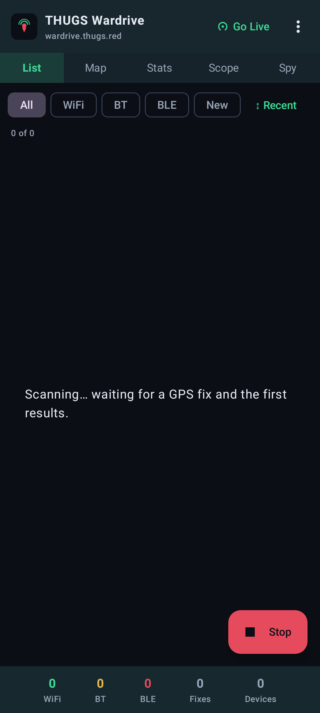

<p align="center"></p>

<div align="center">

# THUGS Wardrive

**A simple WiFi + Bluetooth wardriving app for Android 15+ — scan access points and BT/BLE devices as you move, watch them on a live list and an offline map, then stream them to [wardrive.thugs.red](https://wardrive.thugs.red) or upload a finished session.**

<br/>

-0B0E14?style=for-the-badge&logo=android&logoColor=3DDC97)


<br/>

<a href="https://github.com/kawaiipantsu/thugsred-wardrive-apk/releases/latest/download/THUGS-Wardrive-debug.apk"></a>

<br/>

<samp>foreground-service scanning · offline canvas map · movement-aware battery tuning · live ingest with back-off · optional encrypted credential storage</samp>

</div>

## 📑 Table of Contents

- [⚠️ Account required](#️-account-required)
- [📸 Screenshots](#-screenshots)
- [✨ Features](#-features)
- [📲 Install](#-install)
- [🕹️ Using it](#️-using-it)
- [🔋 Battery &amp; phone setup](#-battery--phone-setup)
- [🛠️ Build from source](#️-build-from-source)
- [🗂️ Project layout](#️-project-layout)
- [🌐 The Wardrive project](#-the-wardrive-project)
- [📄 License](#-license)

## ⚠️ Account required

**Go Live** and **Upload** both sign in to `wardrive.thugs.red`, and that account is **not self-serve**:

1. Register at <https://wardrive.thugs.red/register>.
2. New accounts land **pending** — a THUGS(red) moderator has to approve yours.
3. **Tell THUGS(red) staff on Discord** that you've registered and want wardrive access, so they can approve the account.

Without an approved account the app is **scan-only**: WiFi + Bluetooth scanning, the live list, the map, the counters and local CSV export all work — Go Live and Upload fail at sign-in.

## 📸 Screenshots

<table>
  <tr>
    <td width="33%"><br/><sub><b>List</b> — filter / sort / search, tap for detail</sub></td>
    <td width="33%"><br/><sub><b>Map</b> — points + path, graticule / scale, optional OSM tiles</sub></td>
    <td width="33%"><br/><sub><b>Stats</b> — channels, bands, encryption, rate</sub></td>
  </tr>
  <tr>
    <td width="33%"><br/><sub><b>Scope</b> — live channel congestion + waterfall</sub></td>
    <td width="33%"><br/><sub><b>Spy</b> — devices that are following you (vendor, first/last seen, metres ago)</sub></td>
    <td width="33%"><br/><sub><b>Onboarding</b> — account + permissions</sub></td>
  </tr>
  <tr>
    <td width="33%"><br/><sub><b>Scanning</b> — waiting for a GPS fix</sub></td>
    <td width="33%"><a href="docs/screenshots/about.png">About</a> — project + phone-optimise checklist (tall scroll)</td>
  </tr>
</table>

<sub>Rendered from the real Compose UI on the JVM (Robolectric + Roborazzi) with sample data — `./gradlew :app:recordRoborazziDebug`.</sub>

## ✨ Features

- **Scan** WiFi access points + Bluetooth Classic + BLE, each sighting stamped with a GPS fix.
- **First-run onboarding** — a 3-step walkthrough for the account flow and the runtime permissions (re-openable from Settings).
- **Quick nav** — a `List · Map · Stats · Scope · Spy` strip under the header.
- **List** — one row per device; filter (WiFi/BT/BLE/new), sort (recent/strongest/SSID/channel), text search, tap a row for a detail sheet (all sightings, signal graph, distance, copy BSSID, open on the site).
- **Map** — points + driving path on a Compose `Canvas` (Web Mercator); pinch/pan/fit, follow-me, GPS accuracy ring. Offline by default (lat/long graticule, scale bar, N arrow); **OpenStreetMap tiles are opt-in** (no API key, cached, darkened to match).
- **Stats** — APs per 2.4/5 GHz channel, band split, encryption breakdown, signal histogram, discovery-rate sparkline, least-busy channel.
- **Scope** — a live *channel-congestion* view (beacon-derived, not RF noise): every AP drawn at its real channel width so overlap is visible, plus a rolling waterfall of per-frequency density.
- **Spy mode** — a counter-surveillance view: every MAC/BSSID is checked against your route, and anything seen again at several points spread ~10 m+ apart (after you've moved on) is listed as *following you* — with vendor (IEEE OUI), randomised-MAC flag, first/last seen, how far back you last saw it, and how much of your route it's shadowed. Holds BT/BLE + GPS at full rate while on.
- **Crash-safe logging** — the session CSV is written to disk as you drive, so a kill or crash mid-run doesn't lose it.
- **Go Live** — signs in, mints an ingest token, streams WiFi observations to `POST /api/v1/ingest` in batches with back-off; nothing re-sent once answered. The header button turns into a red **● LIVE** indicator you tap to stop, with the option to clear the streamed session so the same points aren't sent again.
- **Upload / Share** — WiGLE CSV to the moderation queue, or straight to the Android share sheet; saved sessions upload later.
- **Battery** — 1 Hz coalesced state, movement-aware scan cadence, batched BLE, passive WiFi scans, session-scoped wake lock.
- **Stay signed in** (opt-in) stores username + password encrypted via the Android Keystore, device-local; *Forget saved login* wipes it. With a token saved, **Go Live** starts with one tap.
- **Drive mode** (Settings) — removes the idle back-off: fastest GPS + full-power WiFi/BT scanning, moving or not. Best coverage, heaviest battery.
- **Settings** — drive mode, spy mode, tiles, follow-me, keep-screen-on (Map), new-device haptic, units.

## 📲 Install

Debug build, signed with the standard Android debug key.

```bash
adb install -r THUGS-Wardrive-debug.apk
```

Or download and tap it on the phone:
<https://github.com/kawaiipantsu/thugsred-wardrive-apk/releases/latest/download/THUGS-Wardrive-debug.apk>

Per-OS walkthroughs (ADB + no-cable, Play Protect, troubleshooting):
[macOS](docs/Deploy-macOS.md) · [Linux](docs/Deploy-Linux.md) · [Windows](docs/Deploy-Windows.md)

## 🕹️ Using it

Full guide: **[docs/Using-the-App.md](docs/Using-the-App.md)**.

- Grant **Location — all the time**, Nearby WiFi devices, and Nearby devices / Bluetooth.
- **Start scan** runs a foreground service so a drive survives the screen turning off.
- Switch views with the `List · Map · Stats · Scope · Spy` strip; the ⋮ menu holds the actions (Go Live, Upload, Share CSV, Saved sessions, Settings, About).
- WiFi *client* capture needs monitor mode and isn't possible on a stock device — Bluetooth devices are the "clients" you collect alongside APs.

## 🔋 Battery & phone setup

Full checklist: **[docs/Optimising-your-phone.md](docs/Optimising-your-phone.md)**.

Short version: power the phone, exempt the app from battery optimisation, set location to high accuracy, enable "WiFi/Bluetooth scanning", stop WiFi auto-connecting, disconnect BT devices, turn off VPN/Private DNS for sync, dark + dim screen, DND on.

The app already coalesces state to 1 Hz, drops WiFi/BLE to a low-power cadence when the car is stationary, batches BLE delivery, and draws the map locally.

## 🛠️ Build from source

```bash
export JAVA_HOME=/path/to/jdk17
export ANDROID_HOME=/path/to/android-sdk   # needs platforms;android-35, build-tools;35.0.0
./gradlew assembleDebug
# -> app/build/outputs/apk/debug/app-debug.apk
```

Kotlin · Jetpack Compose (Material3) · AGP 8.7 · minSdk / targetSdk / compileSdk 35 · OkHttp. Needs a JDK 17 toolchain.
`applicationId` is `red.thugs.wardrive` (`.debug` suffix on debug builds). Lower `minSdk` in `app/build.gradle.kts` to widen device support.

Screenshot tests (JVM, no emulator) live in `app/src/test/` — `./gradlew :app:recordRoborazziDebug` rewrites `docs/screenshots/`, `:app:verifyRoborazziDebug` fails on a UI change.

## 🗂️ Project layout

```
app/src/main/java/red/thugs/wardrive/
  WardriveApp.kt            process-wide singletons
  MainActivity.kt           permissions + Compose host
  data/     Observation, SessionStore (coalesced + track + crash-safe CSV + congestion/growth
            history + follower tracking), Oui (IEEE vendor lookup), WigleCsvWriter, WifiInfo, Prefs, Geo
  scan/     WifiScanner, BluetoothScanner, ScanService (foreground + power tuning + haptic)
  location/ LocationProvider (isMoving)
  net/      WardriveClient (login/token/ingest/upload), LiveIngestManager
  ui/       MainScreen (WardriveScaffold + quick-nav), OnboardingScreen, MapScreen + OsmTiles, StatsScreen,
            ScopeScreen, SpyScreen, ListView, ObservationDetailSheet, SettingsScreen, CredentialsDialog,
            AboutScreen, MainViewModel, AppIcons, theme/
```

## 🌐 The Wardrive project

`wardrive.thugs.red` is a community site for uploading and exploring wardrive dumps — Kismet, ESP32 rigs, Hak5 WiFi Pineapple and similar: a searchable archive, a map with markers / clustering / heatmap / driving paths, a live-ingest API with bearer tokens, a moderated upload pipeline, build guides and a forum. This app is a phone-sized front end to the live API and the upload queue.

- API guide: <https://wardrive.thugs.red/guides/api>
- API reference: <https://wardrive.thugs.red/api>

## 📄 License

MIT — see [LICENSE](LICENSE).
